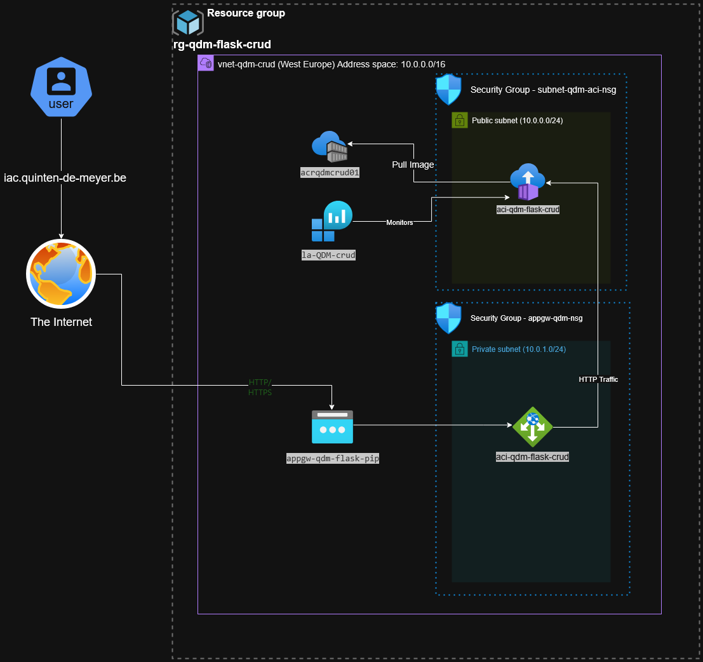

# Assignment 2: Azure Infrastructure-as-Code

## Introduction
For this assignment, I deployed a Flask CRUD application to Azure using Infrastructure as Code (IaC) with Bicep templates. The goal was to demonstrate understanding of cloud infrastructure automation, focusing on containerization, networking, security, and monitoring in Azure.

I chose Bicep over ARM templates for its improved readability and modularity. This implementation shows how IaC can create reproducible, consistent, and version-controlled infrastructure deployments, eliminating manual configuration errors and ensuring infrastructure can be consistently reproduced.

## Architecture Diagram


*The architecture diagram was created using diagrams.net with the Azure Icon set, showing all components and their relationships.*

## Implementation Details

### Container Image Creation
I used the [example-flask-crud](https://github.com/gurkanakdeniz/example-flask-crud) repository as the base application. I containerized this application with a custom Dockerfile:

```dockerfile
FROM mcr.microsoft.com/azure-functions/python:4-python3.9

WORKDIR /app

# Copy from local directory rather than assuming a specific folder structure
COPY . /app/

# Install dependencies - use requirements.txt from the Flask app
RUN if [ -f requirements.txt ]; then pip install --no-cache-dir -r requirements.txt; fi

# Create startup script
RUN echo '#!/bin/bash' > /app/start.sh && \
    echo 'cd /app' >> /app/start.sh && \
    echo 'python -c "from app import db; db.create_all()"' >> /app/start.sh && \
    echo 'python -m flask run --host=0.0.0.0 --port=80' >> /app/start.sh && \
    chmod +x /app/start.sh

ENV FLASK_APP=crudapp.py \
    PYTHONUNBUFFERED=1 \
    AzureWebJobsScriptRoot=/app \
    FLASK_ENV=production

EXPOSE 80

CMD ["/app/start.sh"]
```

This Dockerfile:
- Uses a Python 3.9 base image suitable for Azure Functions
- Sets up a custom startup script to initialize the database and run Flask
- Exposes port 80 for HTTP traffic
- Configures necessary environment variables for Flask

### Azure Container Registry Implementation
For Step 3 of the assignment, I created an Azure Container Registry using Bicep templates and implemented a token with least privilege access. The implementation consists of two Bicep modules:

#### ACR Bicep Module (acr.bicep)
```bicep
// Azure Container Registry Module
@description('Azure region for the ACR')
param location string

@description('Name of the Azure Container Registry')
param acrName string

@description('SKU of the Azure Container Registry')
param acrSku string = 'Basic'

// Create Azure Container Registry
resource acr 'Microsoft.ContainerRegistry/registries@2021-09-01' = {
  name: acrName
  location: location
  sku: {
    name: acrSku
  }
  properties: {
    adminUserEnabled: true
  }
}

// Outputs
output acrId string = acr.id
output acrLoginServer string = acr.properties.loginServer
output acrName string = acr.name 
```

#### ACR Token Bicep Module (acr-token.bicep)
```bicep
// ACR Token Module
@description('Name of the Azure Container Registry')
param acrName string

@description('Name of the token')
param tokenName string = 'acrpull-token'

@description('Name of the scope map')
param scopeMapName string = 'pull-scope-map'

// Create a scope map for pull access only
resource pullScopeMap 'Microsoft.ContainerRegistry/registries/scopeMaps@2023-07-01' = {
  name: '${acrName}/${scopeMapName}'
  properties: {
    actions: [
      'repositories/flask-crud/content/read'
    ]
    description: 'Pull access for flask-crud repository'
  }
}

// Create a token with the scope map
resource acrToken 'Microsoft.ContainerRegistry/registries/tokens@2023-07-01' = {
  name: '${acrName}/${tokenName}'
  properties: {
    scopeMapId: pullScopeMap.id
    status: 'enabled'
  }
  dependsOn: [
    pullScopeMap
  ]
}
```

#### Integration in Main Bicep Template
The ACR modules are referenced in the main Bicep template:

```bicep
// Azure Container Registry
module acrModule 'modules/acr.bicep' = {
  name: 'acrDeployment'
  params: {
    location: location
    acrName: acrName
  }
}

// ACR Token with pull permissions
module acrTokenModule 'modules/acr-token.bicep' = {
  name: 'acrTokenDeployment'
  params: {
    acrName: acrName
    tokenName: acrTokenName
  }
  dependsOn: [
    acrModule
  ]
}
```

#### PowerShell Deployment Automation
The deployment script includes functions to create the ACR and push the container image:

```powershell
# Build and push the container image
function New-ContainerImage {
    # ACR name must be lowercase and globally unique
    $acrName = "acr$($InitialsPrefix.ToLower())crud$AcrSuffix"
    
    # Deploy ACR using Bicep
    az deployment group create `
        --resource-group $ResourceGroupName `
        --template-file bicep/modules/acr.bicep `
        --parameters acrName=$acrName location=$Location
    
    # Login to ACR
    az acr login --name $acrName
    
    # Build and tag the Docker image
    docker build -t $fullImageName .
    
    # Push the image to ACR
    docker push $fullImageName
}

# Create an ACR token with least privilege access
function New-ACRToken {
    # Create a scope map for pull access only
    az acr scope-map create `
        --name pull-scope-map `
        --registry $acrName `
        --repository flask-crud content/read
    
    # Create a token with the scope map
    az acr token create `
        --name $tokenName `
        --registry $acrName `
        --scope-map pull-scope-map
}
```

This implementation satisfies Step 3 of the assignment by:
1. Creating an ACR using Bicep templates
2. Creating a token with least privilege access (read-only for the specific repository)
3. Automating the image build and push process in PowerShell

### Deployment Automation
I created a two-step deployment process:

1. **Service Principal Setup** - I developed a `set-credentials.ps1` script to:
   - Create a Service Principal with appropriate roles
   - Store credentials securely in a local file for automated deployments
   - This enabled non-interactive deployments with least-privilege principles
   - For detailed information on secure credential handling, see [SECURITY.md](./SECURITY.md)

2. **Deployment Script** - I wrote a comprehensive `deploy.ps1` script that:
   - Handles authentication fallback (checks if logged in, uses SP if available)
   - Creates resource groups dynamically if they don't exist
   - Validates Bicep templates before deployment
   - Builds and pushes container images to ACR
   - Manages the full deployment lifecycle with error handling

Example of the authentication logic implemented:

```powershell
# Check if logged in to Azure
$loginStatus = az account show --query "user.name" -o tsv 2>$null
if (-not $loginStatus) {
    Write-Host "Not logged in to Azure. Attempting to log in with service principal..."
    if (Test-Path -Path "sp-credentials.json") {
        $spCreds = Get-Content "sp-credentials.json" | ConvertFrom-Json
        az login --service-principal --username $spCreds.appId --password $spCreds.password --tenant $spCreds.tenant
    } else {
        Write-Host "No service principal credentials found. Please log in interactively."
        az login
    }
}
```

### Bicep Implementation
I created modular Bicep templates with a focus on maintainability and reuse:

#### Container Instance Module (aci.bicep)
This module deploys the container with appropriate configurations:

```bicep
resource containerGroup 'Microsoft.ContainerInstance/containerGroups@2021-09-01' = {
  name: containerGroupName
  location: location
  properties: {
    containers: [
      {
        name: 'flask-crud-container'
        properties: {
          image: containerImageName
          ports: [
            {
              port: port
              protocol: 'TCP'
            }
          ]
          resources: {
            requests: {
              cpu: cpuCores
              memoryInGB: memoryInGb
            }
          }
          livenessProbe: {
            httpGet: {
              path: '/'
              port: port
              scheme: 'http'
            }
            initialDelaySeconds: 30
            periodSeconds: 30
            timeoutSeconds: 5
            successThreshold: 1
            failureThreshold: 3
          }
          readinessProbe: {
            httpGet: {
              path: '/'
              port: port
              scheme: 'http'
            }
            initialDelaySeconds: 15
            periodSeconds: 15
            timeoutSeconds: 5
            successThreshold: 1
            failureThreshold: 3
          }
        }
      }
    ]
    osType: 'Linux'
    restartPolicy: 'Always'
    subnetIds: [
      {
        id: subnetId
      }
    ]
    ipAddress: {
      type: 'Private'
      ports: [
        {
          port: port
          protocol: 'TCP'
        }
      ]
    }
  }
}
```

#### Network Security Group (nsg.bicep)
This module implements security rules to protect the container:

```bicep
resource nsg 'Microsoft.Network/networkSecurityGroups@2021-05-01' = {
  name: nsgName
  location: location
  properties: {
    securityRules: [
      {
        name: 'AllowHTTP'
        properties: {
          priority: 100
          protocol: 'Tcp'
          access: 'Allow'
          direction: 'Inbound'
          sourceAddressPrefix: '*'
          sourcePortRange: '*'
          destinationAddressPrefix: '*'
          destinationPortRange: '80'
          description: 'Allow HTTP traffic to the container'
        }
      }
      {
        name: 'DenyAllInbound'
        properties: {
          priority: 4096
          protocol: '*'
          access: 'Deny'
          direction: 'Inbound'
          sourceAddressPrefix: '*'
          sourcePortRange: '*'
          destinationAddressPrefix: '*'
          destinationPortRange: '*'
          description: 'Deny all other inbound traffic'
        }
      }
    ]
  }
}
```

#### Application Gateway with SSL (appgateway.bicep)
This module configures the Application Gateway with HTTPS support:

```bicep
frontendPorts: [
  {
    name: 'appGatewayFrontendPort'
    properties: {
      port: frontendPort
    }
  }
  // Add HTTPS port if enabled
  {
    name: 'httpsPort'
    properties: {
      port: httpsPort
    }
  }
]
// Add SSL certificate if HTTPS is enabled
sslCertificates: enableHttps ? [
  {
    name: 'iacCertificate'
    properties: {
      data: sslCertificateData
      password: sslCertificatePassword
    }
  }
] : []

// HTTPS listeners configuration
httpListeners: concat([
  {
    name: 'flaskCrudListener'
    properties: {
      frontendIPConfiguration: {
        id: resourceId('Microsoft.Network/applicationGateways/frontendIPConfigurations', appGatewayName, 'appGatewayFrontendIP')
      }
      frontendPort: {
        id: resourceId('Microsoft.Network/applicationGateways/frontendPorts', appGatewayName, 'appGatewayFrontendPort')
      }
      protocol: 'Http'
    }
  }
], enableHttps ? [
  {
    name: 'httpsListener'
    properties: {
      frontendIPConfiguration: {
        id: resourceId('Microsoft.Network/applicationGateways/frontendIPConfigurations', appGatewayName, 'appGatewayFrontendIP')
      }
      frontendPort: {
        id: resourceId('Microsoft.Network/applicationGateways/frontendPorts', appGatewayName, 'httpsPort')
      }
      protocol: 'Https'
      sslCertificate: {
        id: resourceId('Microsoft.Network/applicationGateways/sslCertificates', appGatewayName, 'iacCertificate')
      }
      hostName: httpsHostName
      requireServerNameIndication: !empty(httpsHostName)
    }
  }
] : [])
```

### Network Security Implementation
For security, I implemented:

1. **Network Isolation**:
   - Created a dedicated VNet with separate subnets
   - Placed container instances in a private subnet
   - Used NSGs to restrict traffic between subnets

2. **Traffic Filtering**:
   - Created NSG rules to only allow HTTP/80 traffic to containers
   - Restricted outbound traffic to essential services
   - Configured Application Gateway to be the only entry point

3. **HTTPS Configuration**:
   - Set up Let's Encrypt certificate generation
   - Configured SSL termination at the Application Gateway
   - Implemented proper certificate management and renewal (documented in ssl_guide.md)

For detailed information on the security implementation and best practices, see [SECURITY.md](./SECURITY.md).

### SSL/HTTPS Implementation
I added HTTPS support to the application with the following features:

1. **Application Gateway SSL Support**:
   - Modified the Application Gateway Bicep template to support SSL certificates
   - Configured HTTPS listeners and routing rules
   - Implemented certificate handling in the deployment scripts

2. **Let's Encrypt Integration**:
   - Used Let's Encrypt for free, trusted SSL certificates
   - Created scripts to automate certificate conversion and deployment
   - Documented the full process in ssl_guide.md

3. **Deployment Options**:
   - Created a dedicated `deploy-with-ssl.ps1` script for SSL deployments:

```powershell
# Azure Infrastructure-as-Code Deployment Script with SSL certificate
param (
    [Parameter(Mandatory = $true)]
    [string]$SslCertPath,
    
    [Parameter(Mandatory = $true)]
    [string]$SslCertPassword,
    
    [Parameter(Mandatory = $false)]
    [string]$HttpsHostName = "iac.quinten-de-meyer.be",
    
    [Parameter(Mandatory = $false)]
    [switch]$UseCredentialsFile
)

# Call the main deployment script with SSL parameters
$deployParams = @{
    SslCertPath = $SslCertPath
    SslCertPassword = $SslCertPassword
    HttpsHostName = $HttpsHostName
}

if ($UseCredentialsFile) {
    $deployParams.Add("UseCredentialsFile", $true)
}

Write-Host "Starting deployment with SSL certificate..." -ForegroundColor Cyan

# Execute the main deployment script with SSL parameters
try {
    & .\deploy.ps1 @deployParams
} catch {
    Write-Error "An error occurred during deployment: $_"
    exit 1
}
```

Example of deploying with SSL:
```powershell
# Deploy with SSL certificate
.\deploy-with-ssl.ps1 -SslCertPath "C:\temp\certificate.pfx" -SslCertPassword "YourSecretPassword" -HttpsHostName "iac.quinten-de-meyer.be"
```

### Monitoring Setup
I implemented comprehensive monitoring:

- Configured container logs to stream to Log Analytics
- Set up health probes to monitor container availability
- Created dashboard visualizations for resource utilization
- Enabled diagnostic settings on Application Gateway and NSGs

## Requirements Fulfillment

I have successfully fulfilled all requirements of the Assignment 2: Azure Infrastructure-as-Code as outlined below:

### Step 1: Learn about Infrastructure-as-Code and Bicep templates
- Completed the MS Learn tutorials on IaC and Bicep
- Applied the learned concepts throughout the implementation
- Used Bicep as the primary IaC language for all deployments

### Step 2: Build the container image
- Created a Docker container based on the example-flask-crud application
- Built and tested the containerized application locally
- Optimized the container image size and configuration for Azure deployment

### Step 3: Create Azure Container Registry (ACR)
- Implemented an ACR using Bicep templates with appropriate SKU for cost efficiency
- Created ACR token with least privilege access to the registry
- Set up secure image push/pull workflows in the deployment scripts

### Step 4: Deploy the container to Azure Container Instance
- Deployed the container to ACI using modular Bicep templates
- Configured proper resource allocation (1 CPU, 1GB RAM) to save Azure credits
- Implemented health probes and restart policies for reliability

### Step 5: Implement best practices
- **VNet/Subnet**: Created a dedicated VNet and subnet for the container instance
- **Public IP**: Configured Application Gateway with a public IP for application access
- **HTTP on port 80**: Set up the container to serve HTTP traffic on port 80
- **Traffic Control**: Implemented NSG rules to allow only required traffic
- **Monitoring**: Configured container logs to stream to Azure Monitor

### Extra Features
I went beyond the basic requirements to implement additional security and usability features:

1. **SSL/HTTPS Support**:
   - Implemented HTTPS using Let's Encrypt certificates
   - Configured SSL termination at the Application Gateway
   - Created automated SSL certificate deployment scripts

2. **Custom Domain**:
   - Set up a custom domain "iac.quinten-de-meyer.be" for the application
   - Configured DNS records and domain validation
   - Integrated domain with SSL certificate for secure access

All resources were named following the required convention with my initials, and I ensured optimization of resource consumption to save Azure credits.

## Azure Resources

Below is a list of all Azure resources deployed in the `rg-qdm-flask-crud` resource group located in West Europe region:

| Resource Name | Type | Purpose |
|---------------|------|---------|
| aci-qdm-flask-crud | Container instances | The main container instance running the Flask CRUD application. This resource hosts the containerized application and executes the business logic. |
| acrqdmcrud01 | Container registry | Serves as a private container repository for storing the Flask CRUD application container image. This allows secure, private storage and versioning of the container image. |
| appgw-qdm-flask | Application gateway | Functions as the front-end load balancer and web application firewall, routing HTTP/HTTPS traffic to the container instance. Also provides SSL termination for secure HTTPS connections. |
| appgw-qdm-flask-pip | Public IP address | Provides the public-facing IP address attached to the Application Gateway. This is the entry point for all external traffic to the application. |
| appgw-qdm-nsg | Network security group | Protects the Application Gateway subnet by controlling inbound and outbound network traffic according to security rules. |
| la-QDM-crud | Log Analytics workspace | Collects and analyzes container and application logs, enabling monitoring and troubleshooting of the application. |
| subnet-qdm-aci-nsg | Network security group | Secures the container instance subnet by enforcing network traffic rules, ensuring only authorized communication to and from the container. |
| vnet-qdm-crud | Virtual network | Provides network isolation for all components of the solution, separating the application into appropriate network segments. |

### Requirements Checklist

✅ Step 1: Completed MS Learn tutorials on IaC and Bicep  
✅ Step 2: Built container image based on example-flask-crud  
✅ Step 3: Created ACR using Bicep and implemented token with least privilege  
✅ Step 4: Deployed container to ACI using Bicep  
✅ Step 5: Implemented best practices:  
   ✅ Application running in dedicated VNet and subnet  
   ✅ Application has public IP (via Application Gateway)  
   ✅ Application serves HTTP on port 80  
   ✅ Only required traffic allowed (via NSGs)  
   ✅ Container logs sent to Azure Monitor (via Log Analytics)

## Conclusion
Through this assignment, I demonstrated my understanding of Infrastructure as Code using Bicep templates to deploy a containerized application to Azure. I implemented security best practices, optimized resource usage, and ensured proper monitoring capabilities.

The solution is highly automated through PowerShell scripts and modular Bicep templates, meeting all the requirements specified in the assignment. I ensured all resource names include my initials (QDM) and optimized the resource consumption to save Azure credits. 