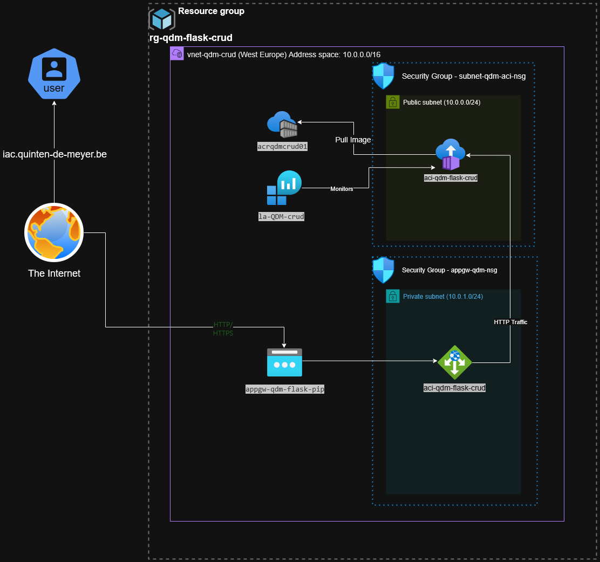

# Azure Flask CRUD Application Deployment

This repository contains Infrastructure-as-Code (IaC) for deploying a containerized Flask CRUD application to Azure using Bicep templates and PowerShell automation.

## Deployment Architecture



*Note: Add an architecture diagram using diagrams.net with Azure icons before submission.*

## What the Deployment Script Does

The `deploy.ps1` script automates the entire deployment process with zero user interaction required. Here's what it does:

### 1. Initial Setup and Authentication
- Sets resource naming conventions with personalized prefix (`QDM`)
- Implements silent authentication using service principal, environment variables, or managed identity
- Creates a resource group in West Europe

```powershell
# From deploy.ps1
# Set fixed values
$InitialsPrefix = "QDM"
$InitialsPrefixLower = $InitialsPrefix.ToLower()
$ResourceGroupName = "rg-$InitialsPrefix-flask-crud"
$Location = "westeurope"

# Silent authentication function
function Connect-Azure-Silent {
    # Try environment variables first (for CI/CD or pre-configured environments)
    $envClientId = $env:AZURE_CLIENT_ID
    $envClientSecret = $env:AZURE_CLIENT_SECRET
    $envTenantId = $env:AZURE_TENANT_ID
    
    # Check if already logged in
    $loginStatus = az account show 2>&1
    if ($LASTEXITCODE -eq 0) {
        $subscriptionInfo = $loginStatus | ConvertFrom-Json
        Write-Host "Already logged in to subscription: $($subscriptionInfo.name)" -ForegroundColor Green
        return $true
    }
    
    # Try service principal from credentials file
    if (Test-Path "sp-credentials.json") {
        $spCreds = Get-Content -Raw -Path "sp-credentials.json" | ConvertFrom-Json
        az login --service-principal -u $spCreds.clientId -p $spCreds.clientSecret --tenant $spCreds.tenantId
        return $true
    }
    
    # Try managed identity if available
    az login --identity 2>&1 | Out-Null
    # ... rest of function
}

# Resource group creation
az group create --name $ResourceGroupName --location $Location
```

### 2. Application Preparation
- Checks for the Flask CRUD application locally
- Clones the application from GitHub if not present
- Verifies Docker availability for local container builds

```powershell
# Clone application if not present
function Ensure-FlaskCrudApp {
    $flaskCrudRepoUrl = "https://github.com/gurkanakdeniz/example-flask-crud.git"
    $flaskCrudDir = "example-flask-crud"
    
    # Check if we're already in the Flask CRUD app directory
    $flaskFiles = @("app.py", "crudapp.py", "static", "templates", "requirements.txt")
    $flaskFound = $false
    
    foreach ($file in $flaskFiles) {
        if (Test-Path $file) {
            $flaskFound = $true
            break
        }
    }
    
    # If Flask CRUD app is not found, clone it
    if (-not $flaskFound) {
        git clone $flaskCrudRepoUrl
        Set-Location $flaskCrudDir
    }
    
    return $true
}

# Check Docker availability
function Test-Docker {
    try {
        $dockerStatus = docker info 2>&1
        if ($LASTEXITCODE -ne 0) {
            Write-Host "Docker is installed but not running. Will use ACR Tasks instead." -ForegroundColor Yellow
            return $false
        }
        return $true
    }
    catch {
        return $false
    }
}
```

### 3. Infrastructure Deployment
- **Azure Container Registry (ACR)**
  - Creates a private container registry for image storage
  - Configures least-privilege access tokens

```bicep
// From modules/acr.bicep
@description('Name for the Azure Container Registry')
param acrName string

@description('Location for the resources')
param location string

@description('Admin username for container registry')
param acrAdminUsername string

resource containerRegistry 'Microsoft.ContainerRegistry/registries@2023-07-01' = {
  name: acrName
  location: location
  sku: {
    name: 'Basic'
  }
  properties: {
    adminUserEnabled: true
    adminUsername: acrAdminUsername
    policies: {
      trustPolicy: {
        type: 'Notary'
        status: 'disabled'
      }
      retentionPolicy: {
        days: 7
        status: 'disabled'
      }
    }
  }
}

// PowerShell for ACR token creation
// az acr token create --name $tokenName --registry $acrName --scope-map _repositories_pull
```

- **Networking Configuration**
  - Establishes a dedicated virtual network (`10.0.0.0/16`)
  - Creates a subnet (`10.0.0.0/24`) with Container Instance delegation
  - Implements network security groups allowing only HTTP traffic (port 80)

```bicep
// From modules/network.bicep
@description('Virtual network name')
param vnetName string

@description('Subnet name')
param subnetName string

@description('Location for the resources')
param location string

resource nsg 'Microsoft.Network/networkSecurityGroups@2023-05-01' = {
  name: '${subnetName}-nsg'
  location: location
  properties: {
    securityRules: [
      {
        name: 'AllowHTTP'
        properties: {
          description: 'Allow HTTP traffic to container'
          protocol: 'Tcp'
          sourcePortRange: '*'
          destinationPortRange: '80'
          sourceAddressPrefix: '*'
          destinationAddressPrefix: '*'
          access: 'Allow'
          priority: 100
          direction: 'Inbound'
        }
      }
    ]
  }
}

resource virtualNetwork 'Microsoft.Network/virtualNetworks@2023-05-01' = {
  name: vnetName
  location: location
  properties: {
    addressSpace: {
      addressPrefixes: [
        '10.0.0.0/16'
      ]
    }
    subnets: [
      {
        name: subnetName
        properties: {
          addressPrefix: '10.0.0.0/24'
          networkSecurityGroup: {
            id: nsg.id
          }
          delegations: [
            {
              name: 'DelegationService'
              properties: {
                serviceName: 'Microsoft.ContainerInstance/containerGroups'
              }
            }
          ]
        }
      }
    ]
  }
}
```

- **Monitoring Setup**
  - Creates a Log Analytics workspace
  - Configures container logging to Azure Monitor

```bicep
// From modules/log-analytics.bicep
@description('Log Analytics workspace name')
param logAnalyticsName string

@description('Location for the resources')
param location string

resource logAnalyticsWorkspace 'Microsoft.OperationalInsights/workspaces@2022-10-01' = {
  name: logAnalyticsName
  location: location
  properties: {
    sku: {
      name: 'PerGB2018'
    }
    retentionInDays: 30
    features: {
      enableLogAccessUsingOnlyResourcePermissions: true
    }
  }
}

output workspaceId string = logAnalyticsWorkspace.properties.customerId
output primaryKey string = logAnalyticsWorkspace.listKeys().primarySharedKey
output portalUrl string = 'https://portal.azure.com/#@/resource${logAnalyticsWorkspace.id}/overview'
```

### 4. Container Deployment
- Builds the Flask application container image
- Pushes the image to Azure Container Registry
- Deploys the container to Azure Container Instance with:
  - Network integration (runs in the dedicated subnet)
  - Public IP address for access
  - Log Analytics integration
  - Proper resource sizing (1 CPU, 2GB memory)

```powershell
# Building and pushing container image
if ($dockerAvailable) {
    # Build container locally
    docker build -t flask-crud-app:latest .
    
    # Tag and push container
    docker tag flask-crud-app:latest "$($acrLoginServer)/flask-crud-app:latest"
    az acr login --name $acrName
    docker push "$($acrLoginServer)/flask-crud-app:latest"
} else {
    # Use ACR Tasks for remote build
    az acr build --registry $acrName --image flask-crud-app:latest .
}
```

```bicep
// From modules/container-instance.bicep
@description('Name of the Container Instance')
param aciName string
@description('Subnet ID for container instance')
param subnetId string
@description('Log Analytics Workspace ID')
param logAnalyticsWorkspaceId string
@description('Log Analytics Workspace primary key')
param logAnalyticsWorkspaceKey string

resource containerGroup 'Microsoft.ContainerInstance/containerGroups@2023-05-01' = {
  name: aciName
  location: location
  properties: {
    sku: 'Standard'
    containers: [
      {
        name: 'flask-crud-app'
        properties: {
          image: '${acrLoginServer}/${containerImageName}'
          ports: [
            {
              port: 80
              protocol: 'TCP'
            }
          ]
          resources: {
            requests: {
              cpu: cpuCores
              memoryInGB: memoryInGb
            }
          }
          environmentVariables: [
            {
              name: 'FLASK_APP'
              value: 'crudapp.py'
            }
          ]
        }
      }
    ]
    osType: 'Linux'
    restartPolicy: 'Always'
    ipAddress: {
      type: 'Public'
      ports: [
        {
          port: 80
          protocol: 'TCP'
        }
      ]
    }
    // Container registry authentication
    imageRegistryCredentials: [
      {
        server: acrLoginServer
        username: 'acrAdmin'
        password: listCredentials(resourceId('Microsoft.ContainerRegistry/registries', acrName), '2023-07-01').passwords[0].value
      }
    ]
    // Log Analytics integration
    diagnostics: {
      logAnalytics: {
        workspaceId: logAnalyticsWorkspaceId
        workspaceKey: logAnalyticsWorkspaceKey
        logType: 'ContainerInsights'
      }
    }
    // VNet integration
    subnetIds: [
      {
        id: subnetId
      }
    ]
  }
}
```

### 5. Best Practices Implementation
- **Security**
  - Network isolation through dedicated VNet
  - Restricted inbound/outbound traffic with NSG rules
  - Principle of least privilege for all access

```bicep
// NSG rules showing security best practices
resource nsg 'Microsoft.Network/networkSecurityGroups@2023-05-01' = {
  // ...
  properties: {
    securityRules: [
      {
        name: 'AllowHTTP'
        properties: {
          // Only allow HTTP traffic
          protocol: 'Tcp'
          destinationPortRange: '80'
          access: 'Allow'
          priority: 100
          direction: 'Inbound'
        }
      },
      {
        name: 'DenyAllInbound'
        properties: {
          // Deny all other inbound traffic
          protocol: '*'
          sourcePortRange: '*'
          destinationPortRange: '*'
          sourceAddressPrefix: '*'
          destinationAddressPrefix: '*'
          access: 'Deny'
          priority: 4096
          direction: 'Inbound'
        }
      }
    ]
  }
}
```

- **Monitoring**
  - Centralized logging with Azure Monitor
  - Container health metrics

```bicep
// Container monitoring configuration
diagnostics: {
  logAnalytics: {
    workspaceId: logAnalyticsWorkspaceId
    workspaceKey: logAnalyticsWorkspaceKey
    logType: 'ContainerInsights'
    metadata: {
      'log-type': 'container-insights'
    }
  }
}
```

- **Cost Optimization**
  - Right-sized resources to minimize Azure costs
  - Basic SKU selection where appropriate

```bicep
// Cost optimized resource allocation
param cpuCores int = 1  // Minimal CPU needed for Flask app
param memoryInGb int = 2  // Sufficient memory without over-provisioning

// Using Basic SKU for ACR to minimize costs
resource containerRegistry 'Microsoft.ContainerRegistry/registries@2023-07-01' = {
  name: acrName
  sku: {
    name: 'Basic'  // Lower cost SKU that meets requirements
  }
  // ...
}
```

## Running the Deployment

To deploy the application:

```powershell
# Just run the deployment script
./deploy.ps1
```

The script handles everything automatically, including:
- Authentication
- Resource provisioning
- Container building and pushing
- Container instance deployment

## Accessing the Application

After deployment completes, the script outputs:
- The container's public IP address
- Log Analytics workspace URL for monitoring

```powershell
# Script output section showing deployment results
Write-Host "Deployment completed successfully!" -ForegroundColor Green
Write-Host "Container IP Address: $($containerIP)" -ForegroundColor Cyan
Write-Host "Access the application at: http://$($containerIP)" -ForegroundColor Cyan
Write-Host "Log Analytics Portal: $($logAnalyticsPortalUrl)" -ForegroundColor Cyan
```

Access the application at: `http://<container-ip-address>`

## Resource Cleanup

To avoid unnecessary Azure costs, run:

```powershell
az group delete --name rg-QDM-flask-crud --yes
```

## Technical Components

The deployment uses modular Bicep templates:
- `main.bicep`: Orchestrates the deployment workflow
- `modules/acr.bicep`: Container registry setup
- `modules/network.bicep`: VNet, subnet and NSG configuration
- `modules/log-analytics.bicep`: Monitoring setup
- `modules/container-instance.bicep`: Container deployment with VNet integration

```bicep
// From main.bicep - showing module orchestration
// Azure Container Registry
module acr './modules/acr.bicep' = {
  name: 'acrDeployment'
  params: {
    acrName: acrName
    location: location
    acrAdminUsername: acrAdminUsername
  }
}

// Log Analytics Workspace for monitoring
module logAnalytics './modules/log-analytics.bicep' = {
  name: 'logAnalyticsDeployment'
  params: {
    logAnalyticsName: logAnalyticsName
    location: location
  }
}

// Virtual Network and Subnet with NSG
module network './modules/network.bicep' = {
  name: 'networkDeployment'
  params: {
    vnetName: vnetName
    subnetName: subnetName
    location: location
  }
}

// Container Instance with dependencies on other modules
module containerInstance './modules/container-instance.bicep' = {
  name: 'containerInstanceDeployment'
  params: {
    aciName: aciName
    location: location
    acrName: acrName
    acrLoginServer: acr.outputs.acrLoginServer
    logAnalyticsWorkspaceId: logAnalytics.outputs.workspaceId
    logAnalyticsWorkspaceKey: logAnalytics.outputs.primaryKey
    subnetId: network.outputs.subnetId
  }
  dependsOn: [
    acr
    logAnalytics
    network
  ]
}
``` 